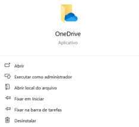
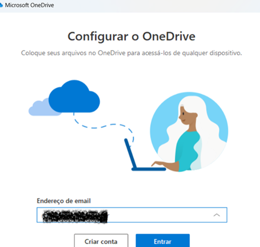
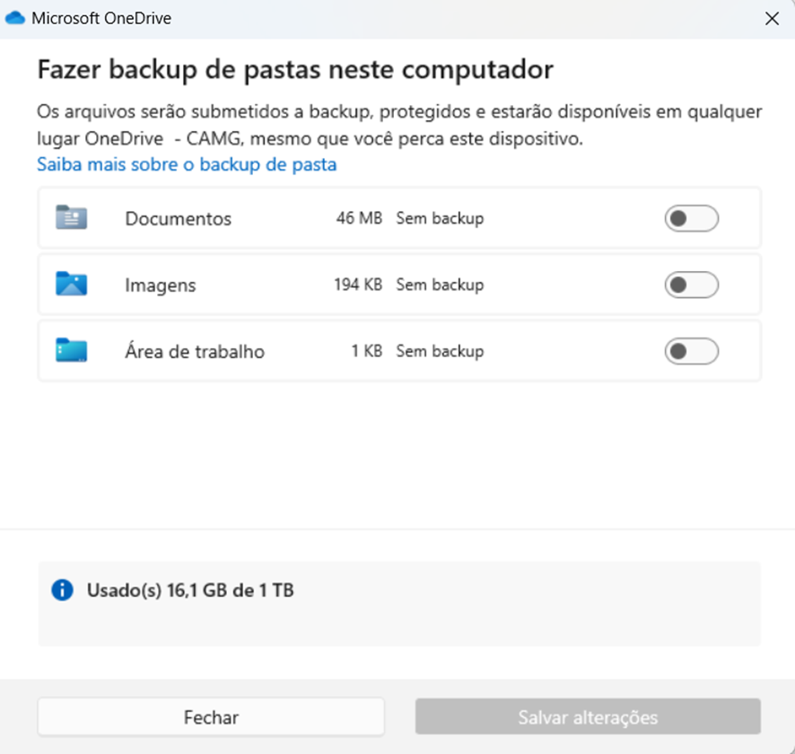
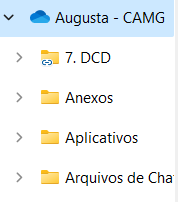

# Utilizando a aplicação do One Drive para trabalhar com arquivos do SharePoint na versão desktop

Recentemente, na construção de um robô no Power Automate, precisei mudar um loop - que inicialmente atuava sobre um Excel versão desktop - para que ele passasse a atuar sobre a versão online do mesmo documento. Isso por conta de um fluxo no Power Automate web que havia sido construído para esse mesmo fluxo, o qual utilizava o parâmetro do documento online e não de um documento na própria máquina.  
No entanto, me deparei com a limitação da licença padrão do Automate, que não libera ações do SharePoint a menos que a conta seja premium. Diante dessa limitação, a solução encontrada envolveu o aplicativo do One Drive, que pôde levar à máquina os arquivos do SharePoint e fazer com que fosse possível seguir adiante o meu fluxo.
Neste post, explico como esse processo foi feito para auxiliar colegas na mesma situação.

<!-- more -->

1. Inicialmente, verifique se a máquina em que você trabalha possui o aplicativo do One Drive instalado:

2. Depois, faça login no One Drive com sua conta corporativa:

3. Desmarque as opções de "backup das pastas neste computador":

Pronto! Agora, é só buscar por "One Drive" na sua máquina de trabalho que, ao clicar, estarão lá reunidos todos os arquivos que o seu SharePoint tem. 

A sincronização é automática, então tudo o que for alterado e salvo em um será refletido no outro. Lembre-se apenas de **deixar um arquivo fechado enquanto se edita o outro** (janela do Chrome fechada enquanto se mexe no arquivo desktop, e vice versa).
Além disso, quando a edição for feita no documento desktop (Excel, por exemplo), não se esqueça de **clicar em "Editar pasta de trabalho"** antes de fazer as alterações:

Assim, você conseguirá salvar seu trabalho e não haverá problemas de versão.

