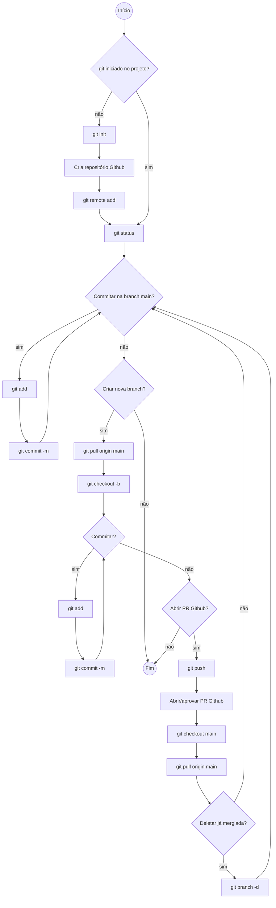

# Configurações para criar posts e atualizar os sites do AutomatizaMG

Aqui na equipe Automatiza.MG todo dia é dia de conhecimento!

Nesse post listaremos todas as configurações necessárias para instalar e configurar o Git, o Python, o MkDocs e outras ferramentas úteis para atualizar os sites do AutomatizaMG, bem como criar novos post nos blogs.

Não perca essa oportunidade de contribuir para o crescimento de nossa equipe, seja participando como ouvinte ou como tutor! É a nossa chance de se atualizar, compartilhar conhecimento e aprimorar nossas habilidades! :rocket::rocket:

<!-- more -->

## Estrutura geral dos repositórios que sustentam os sites estáticos:

````
- .github

 - workflows

- docs

 - assets

 - blog

  - posts

   - .authors.yml

   - index.md

- pasta menu principal

- pasta menu principal

- overrides

- sources

- venv

 - .gitignore

 - abbreviations.md

 - CHANGELOG.md

 - mkdocs.yml

 - README.md

 - requirements.txt
````


## 1. Github e Git Bash (CLI)

**1.1.** Fazer conta no [Github](https://github.com/) e confirmar conta no email

**1.2.** Definir perfil de acesso nos repositórios

**1.3.** Baixar [Git Bash](https://git-scm.com/downloads)

**1.4.** Configurar Git Bash

```bash
git config --global user.name "andrelamor"
git config --global user.email "andre.amorim@planejamento.mg.gov.br"
git config --list # lista as configuracoes atuais
```

- [Referência](https://swcarpentry.github.io/git-novice/02-setup.html)

**1.5.** Arquivos e diretórios

- Referências: 

  - [Navegando por arquivos e diretórios](https://swcarpentry.github.io/shell-novice/02-filedir.html)

  - [trabalhando com arquivos e diretórios](https://swcarpentry.github.io/shell-novice/03-create.html)

**1.6.** Trabalhando com arquivos e repositórios

* Fluxo de trabalho

```bash
  git clone <url> # importar repositório
  git pull # importar últimas mudanças do ORIGIN MAIN 
  git status 
  git add <files> # levar arquivos alterados para STAGING AREA
  git diff # verificar alterações nos arquivos
  git commit -m "<message>"
  git status # estado do repositório
  git log
  git push origin main
```

* Inicializar repositório
  
```bash
  git init
```

- **Pontos importantes**

- 
- 

- **Referências:** 

  - [Software Carpentry](https://swcarpentry.github.io/git-novice/03-create.html)

  - [Principais comandos do Git](https://res.cloudinary.com/practicaldev/image/fetch/s--Zib71Fgv--/c_limit%2Cf_auto%2Cfl_progressive%2Cq_auto%2Cw_880/https://dev-to-uploads.s3.amazonaws.com/uploads/articles/n082uxea33j6zq3mca7u.png)

  - [Listando os principais comandos utilizados na Git Bash](https://automatiza-mg.github.io/handbook/blog/listando-os-principais-comandos-utilizados-na-git-bash/)

  - [Como modificar um commit](https://automatiza-mg.github.io/handbook/blog/como-modificar-um-commit-simple-git/)

  - [Criando novos repositórios GitHub](https://automatiza-mg.github.io/handbook/blog/criando-novos-reposit%C3%B3rios-github/)


## 2. Instalar e configurar _Python_


Seguir os passos indicados [neste post](https://automatiza-mg.github.io/handbook/blog/passo-a-passo-para-instala%C3%A7%C3%A3o-do-python-no-computador/#confirmacao-da-instalacao).

Após inserção das pastas do _Python_ no PATH como variável de ambiente (WINDOWS), verificar se o terminal BASH (CLI) também o identifica, como o CMD do Windows:  

```bash
$ python --version
Python 3.13.1
```

## 3. Instalar e congigurar ferramentas de interface gráfica (GUI)

1. Editor de texto: [Sublime Text](https://www.sublimetext.com/)

   - Modificar editor de texto padrão, de Vim para Sublime Text
- `$ git config --global core.editor "'c:/program files/sublime text 3/sublime_text.exe' -w"`

3. Ferramenta GUI para o gihub: [Sublime Merge](https://www.sublimemerge.com/download)

4. Verificar se as pastas dos sowtwares acima estão no PATH das variáveis de ambiente 


## 4. Ambiente virtual e gerenciamento de dependências (_requirements_)

Para utilizar ferramentas de site estático, precisamos simular localmente as alterações, antes de enviá-las para o reositório ORIGIN do Github. Para isso, instalamos pacotes usando ambiente virtual do Python, via linha de comnado (Git bash).

Os arquivos `requirements.txt` [exemplo](https://github.com/automatiza-mg/handbook/blob/main/requirements.txt) em cada repositório contém essas dependências a serem instaladas.

```bash
# grep para filtrar resultado de uma busca
$ ls -la | grep handbook

# criação ambiente virtual python - apenas uma vez por repositório
# windowns, linux e emac
$ python -m venv venv

# ativação ambiente nowindows
$ source venv/Scripts/activate
# ativação ambiente nolinux e mac
$ source venv/bin/activate

# instalação pacotes - apenas uma vez, ou sempre que novo
# pacote for acrescentado no arquivo requirements.txt
$ pip install -r requirements.txt

# veririfcar pacotes instalados
$ pip list
```

- **Pontos importantes**

- 
- 

**- Referências:** 

  - [Webnar Automatiza.MG #7](https://automatiza-mg.github.io/handbook/blog/webnar-automatizamg-7/) 

  - [Webnar Automatiza.MG #8](https://automatiza-mg.github.io/handbook/blog/webnar-automatizamg-8/)


## 5. Criar e editar posts no blog e novas seções nos sites (_Mkdocs_)

Após instalar os pacotes necessários, o próximo passo, após ativar o servidor local (_venv_) é projetar o site localmente através do pacote _MKDocs_:

```bash
# ativação ambiente no windows
$ source venv/Scripts/activate
# ativação ambiente no linux e mac
$ source venv/bin/activate

# ligar servidor local mkdocs
$ mkdocs serve

# construir documentação (quando arquivo novo for adicionado no mkdocs.yml)
$ mkdocs build
```

Caso haja algum conteúdo novo em aba do site que não seja a do _Blog_, será necessário adicionar a respectiva referência no arquivo [_mkdocs.yml_](https://github.com/automatiza-mg/handbook/blob/main/mkdocs.yml), e construir a documentação no MKDocs, antes de projetá-la localmente:

```bash
# construir documentação (quando arquivo novo for adicionado no mkdocs.yml)
$ mkdocs build
```

**- Referências:** 
  
  - [Webnar Automatiza.MG #7](https://automatiza-mg.github.io/handbook/blog/webnar-automatizamg-7/) 

  - [Criando nova sessão de submenu no site](https://automatiza-mg.github.io/handbook/blog/criando-nova-sess%C3%A3o-mkdocs-simple-materialformkdocs/)

  - [Como editar títulos dos posts no MKDocs](https://automatiza-mg.github.io/handbook/blog/como-editar-t%C3%ADtulos-dos-posts-no-mkdocs/)


## 6. Criar e editar fluxogramas (Mermaid)

- O fluxo ilustrando a sequência de ações no github: 


**- Referências:** 

  - [Webnar Automatiza.MG #9](https://automatiza-mg.github.io/handbook/blog/webnar-automatizamg-8/)

  - [Documentação Sintaxe Fluxos Mermaid](https://mermaid.js.org/syntax/flowchart.html)


## Referências Gerais

- [Documentação Material Mkdocs](https://squidfunk.github.io/mkdocs-material/) 
- 
