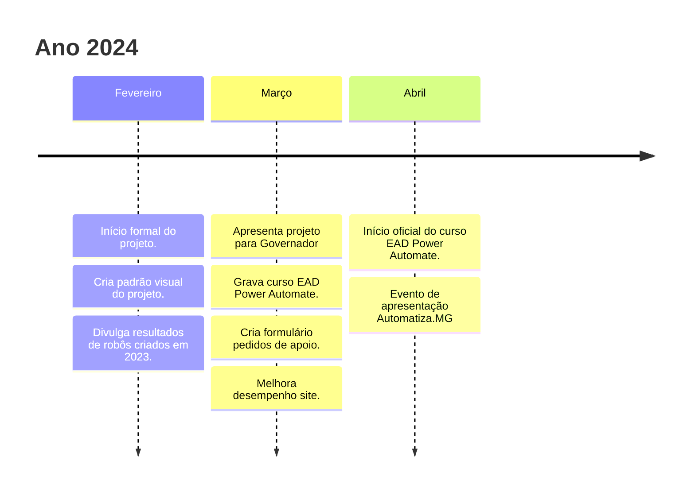
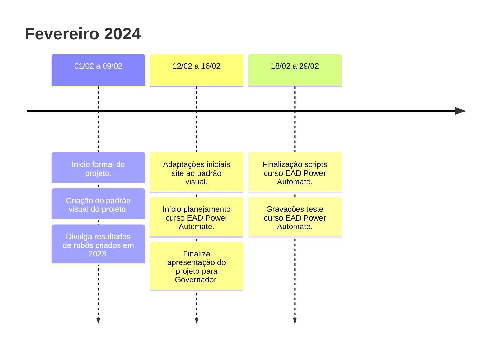
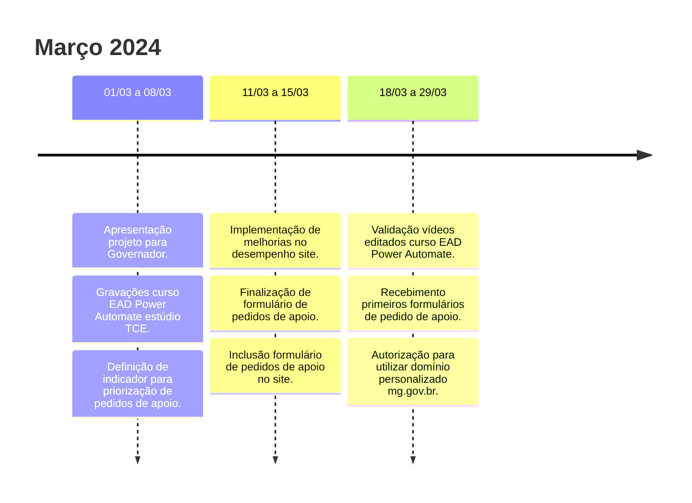
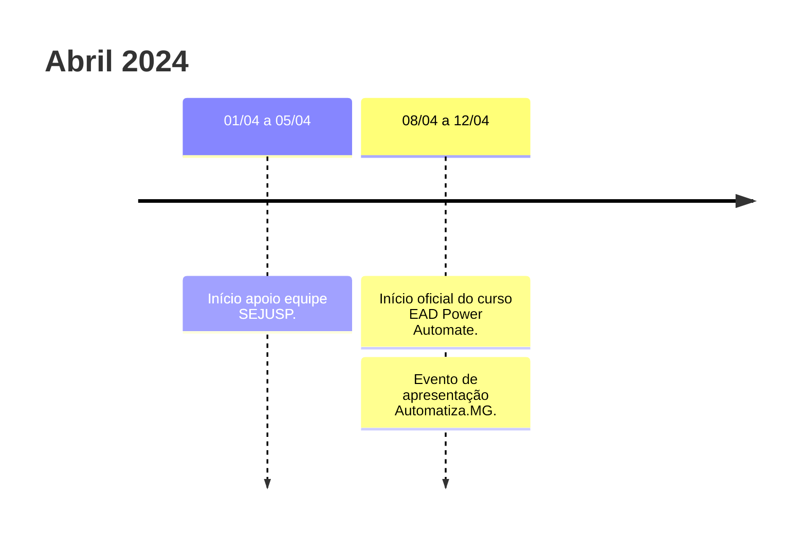

# Linha do Tempo Projeto Automatiza-MG

O projeto [Automatiza-MG](https://automatiza-mg.github.io/automatizacoes/) consiste em uma séria de ações para disseminar a utilização de ferramentas de Automatizações de processos do Estado de Minas Gerais. Principais entregas:

- Curso EAD de Power Automate.
- [Biblioteca de robôs](https://automatiza-mg.github.io/automatizacoes/robos/).
- Divulgação ampla do projeto, potencial de utilização e resultados.

A documentação que detalha todas as ações e produtos finais pode ser encontrada:

- Na tag [Automatiza-MG](../../tags/#automatiza-mg).
- No [repositório GitHub](https://github.com/automatiza-mg/automatizacoes) criado para hospedar o site do projeto.
- Neste [GitHub Project Board](https://github.com/orgs/automatiza-mg/projects/1/views/15).

## Visão Geral

## Visão mensal detalhada

